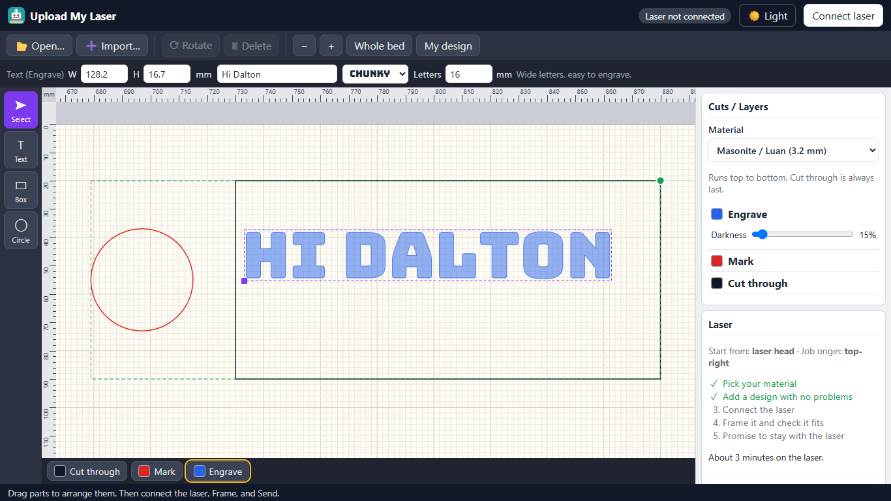

# uploadmylaser

A kid-safe laser sender for Chromebook classrooms. Students open a website, pick their material,
drop in an SVG or DXF (or type their name), arrange it on the laser bed, and send it to the
classroom **Boss LS36 laser (Ruida RDC6445S controller)** over USB with the Web Serial API. Nothing
is installed on the student machine: no LightBurn, no driver, no extension, no account.

It exists because managed Chromebooks cannot run LightBurn, and a class of thirty needs a simple,
safe way to get a name tag or a box onto the laser. LightBurn stays on the teacher's Windows laptop
for complex projects. This handles "kid mode".

- **Students never choose power or speed.** The teacher sets presets per material. The server
  resolves them, and the processing container clamps every layer to a machine ceiling again before
  any bytes exist. The only knob a student may get is an engrave "darkness" slider inside a range the
  teacher allows.
- Runs on Cloudflare Workers + Containers, like its sibling
  [uploadmycode](https://github.com/daltonjfowler/uploadmycode). About $5/month plus pennies of usage.
- Written and maintained by one teacher, [Dalton Fowler](https://daltonjfowler.com). The code is
  kept boring on purpose.

## Screenshot



The student page at Chromebook resolution (1366x768): a cut-through box, engraved text and a marked
circle, with the text selected. There is a [dark mode](docs/screenshot-student-dark.png) too.

## What it does

- **Draw with three colours.** Black cuts through, red marks a line, blue engraves (fills the shape).
  SVG strokes/fills and DXF layers or colours are mapped the same way, and any other colour asks the
  student what it should do.
- **LightBurn-style workspace.** Open (start over with a file) and Import (add a file next to what's
  there), Text with seven fonts, Box, Circle, Line and Curve tools, a Shapes library (stars, hearts,
  sports balls, callouts, a potted plant...), a Pattern tool for rows and columns of copies, Ctrl+A multi-select,
  handles on every corner and side, a move grip, a size lock, Scale %, Undo/Redo, rotate, mm rulers,
  and mouse-wheel or pinch zoom. Designs autosave to the Chromebook's `localStorage`.
- **Runs in a safe order.** Engrave, then Mark, then Cut through, always last with all its passes,
  because parts that are cut free can shift. Inner cuts go before outer ones.
- **Frame before every Send.** The laser traces the job's outline with the beam off. Send stays
  disabled until this exact job has been framed and the student ticks "I will stay with the laser".
  STOP is sent from the browser, so it works even if the network is down (and Esc does the same).
- **A rolling class phrase.** The teacher sets today's phrase, with an expiry, from a `/teacher` page
  guarded by a secret key. The site opens for anyone, but nothing is processed without the phrase.
- **Teacher page.** Materials and presets (materials named PVC, vinyl and other unsafe plastics are refused by name; a
  name check cannot know what a sheet really is), machine
  settings, the class phrase, and a warm-up button for the container.
- **Cost caps.** Scale-to-zero containers that sleep after 5 minutes, a per-Chromebook rate limit, a
  global ceiling, a 10 MB upload cap and a processing timeout.
- **Private by default.** No student accounts, no server-side storage of designs, self-hosted fonts,
  and a strict Content Security Policy, so student Chromebooks load nothing from third parties.

## The live site

<https://uploadmylaser.com> is the author's own instance, **for one school district's classrooms
only**. It is not a public service: processing needs that day's class phrase, so the site will not do
anything useful for anyone who is not in the room. It is up as a working reference, not as something
to sign up for.

**To use this, run your own copy.** [docs/SETUP.md](docs/SETUP.md) walks through it.

## How it works

```
Chromebook (Chrome)                          Cloudflare
  UI: arrange parts, preview   ── POST /api/process ──►  Worker: phrase, rate limit, validation,
  Web Serial ── USB ──► Ruida                            presets from KV
  (streams .rd bytes, STOP)    ◄── preview + .rd ──────  Container (Python): SVG/DXF/text → toolpaths
                                                         → hatch fill → Ruida .rd encoder
```

The Ruida `.rd` encoder mirrors what LightBurn writes for this controller, checked against real
LightBurn files in [test/golden/](test/golden/). See [docs/HARDWARE.md](docs/HARDWARE.md) for what has
been verified on the machine, and [PLAN.md](PLAN.md) for the full design.

## Commands

```sh
npm install
npm run typecheck   # tsc for the Worker and for web/
npm test            # node --test: Worker security and validation, frontend helpers
npm run test:py     # pytest: geometry, encoder, golden .rd files (needs container/requirements-dev.txt)
npm run dev:web     # Vite dev server, proxies /api to wrangler dev on :8787
npm run build       # vite build web -> public/
npm run icons       # redraw the logo PNGs from scripts/make-icons.mjs
npm run deploy      # build, then wrangler deploy (needs Docker running)
```

## Docs

- [docs/SETUP.md](docs/SETUP.md): **run your own copy.** Start here if this repo is new to you.
- [docs/DEPLOY.md](docs/DEPLOY.md): the operator manual for the live instance: daily routine, security,
  the teacher key, `ALLOWED_CIDRS`, local development.
- [docs/STUDENT_GUIDE.md](docs/STUDENT_GUIDE.md): one page to post next to the laser.
- [docs/TEST_PLAN.md](docs/TEST_PLAN.md): automated checks and the hardware test script.
- [docs/HARDWARE.md](docs/HARDWARE.md): what is known and verified about the Ruida protocol on this machine.
- [PLAN.md](PLAN.md): architecture and the plan the project was built from.
- [CREDITS.md](CREDITS.md): every open-source project this stands on.

## Safety

This software sends jobs to a Class 4 laser. It is a convenience, not a safety system. The laser's
physical emergency stop, lid interlock, fire safety equipment, ventilation, and an adult who is
trained on the machine remain the real safety measures. Never leave a running laser unattended, and
never laser PVC, vinyl, or other chlorine-containing materials. Use it at your own risk; see the
MIT license's warranty disclaimer.

## Trademarks and licensing

LightBurn, Ruida and Boss Laser are trademarks of their respective owners. This project is an independent tool written by a
teacher. It is not affiliated with, sponsored by, or endorsed by any of them. Those names are used
only to describe what this software is compatible with. The Ruida protocol handling was written from
public reverse-engineering notes and the MIT-licensed [MeerK40t](https://github.com/meerk40t/meerk40t)
project (see [CREDITS.md](CREDITS.md)).

This project's own code is MIT licensed. See [LICENSE](LICENSE).

## Credits

Built on other people's work. [CREDITS.md](CREDITS.md) lists every open-source project it uses, with
a link and license for each. None of those projects endorses this one. Made by
[Dalton Fowler](https://daltonjfowler.com), who also made
[uploadmycode](https://uploadmycode.com) and [teachChat.app](https://teachchat.app).
